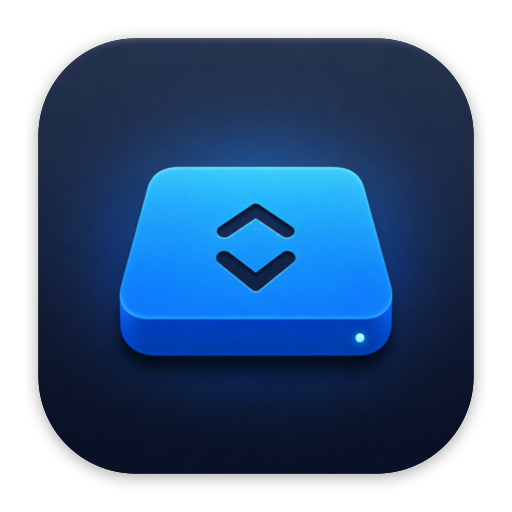

<p align="center">
  
</p>

<h1 align="center">NTFStore</h1>

<p align="center">
  <b>Read &amp; write NTFS drives on macOS — from a clean menu-bar app.</b><br>
  by <b>Pritish Maheta</b>
</p>

<p align="center">
  <a href="LICENSE"></a>
  
  
  <a href="https://github.com/Pritish053/ntfstore/releases/latest"></a>
  
  
</p>

---

macOS mounts NTFS (Windows-formatted) drives **read-only**. NTFStore adds
full **read-write** support using a modern, **kext-free** stack (FUSE-T + ntfs-3g)
and gives you a one-click menu-bar control for mounting, unmounting and ejecting.

No kernel extensions. No "Reduced Security". No reboots.

---

## Features

- ✅ **Read & write** any NTFS drive
- 🖱️ **Menu-bar app** — mount / unmount / eject / open in Finder, per drive
- 🧩 **Kext-free** — built on [FUSE-T](https://www.fuse-t.org/) (no kernel extension, no Recovery Mode)
- 🔒 **No password prompts** — a scoped `sudo` NOPASSWD rule for the mount helper only
- 💪 **Robust** — force-mounts dirty / hibernated (Windows fast-startup) volumes, wins the macOS FSKit auto-mount race, and auto-recovers a drive yanked without ejecting
- 🪶 **Light** — a tiny Swift app + one shell helper; starts at login
- 🧹 **Clean uninstall** included

Menu:

```
NTFStore — Pritish Maheta
──────────────────────────────
🟢 Seagate Pritish — read-write  ▸  Open in Finder
                                     Unmount
                                     Eject (safe to unplug)
──────────────────────────────
Mount all read-write        ⌘M
Refresh                     ⌘R
Quit NTFStore           ⌘Q
```

---

## Why NTFStore?

| | **NTFStore** | Paid drivers (Paragon, Tuxera…) | Built-in macOS |
|---|:---:|:---:|:---:|
| Price | **Free & open source** | Paid | Free |
| Write to NTFS | ✅ | ✅ | ❌ read-only |
| Kernel extension | ✅ **none** (FUSE-T) | often required | — |
| Reduced Security / reboot | ✅ **never** | sometimes | — |
| Menu-bar mount / eject | ✅ | varies | ❌ |
| Handles dirty / hibernated drives | ✅ `force` | varies | ❌ |
| Auditable code | ✅ ~210-line Swift app | ❌ closed | — |

NTFStore is a thin, transparent wrapper around the battle-tested open-source
**ntfs-3g** driver running on kext-free **FUSE-T** — no black boxes, no kernel
code, no subscription.

## Requirements

- macOS 12+ (built and tested on **macOS 26**, Apple Silicon)
- [Homebrew](https://brew.sh)
- Xcode Command Line Tools (`xcode-select --install`)

## Install

```bash
git clone <this-repo> NTFStore
cd NTFStore
./install.sh
```

The installer will:
1. Install **FUSE-T** and **ntfs-3g** via Homebrew
2. Build the `libfuse.2.dylib` **shim** so ntfs-3g uses FUSE-T
3. Install the privileged **mount helper** + a scoped `sudo` NOPASSWD rule
4. Build & install **NTFStore.app** and set it to start at login

You'll be asked for your password once. The first mount may ask you to approve
FUSE-T in **System Settings → Privacy & Security**.

## Usage

1. Plug in an NTFS drive.
2. Click the **🖴 NTFS** icon in the menu bar.
3. Hover your drive → **Mount read-write**.
4. When done, **Eject (safe to unplug)** before pulling the cable.

## Uninstall

```bash
./uninstall.sh          # remove NTFStore
./uninstall.sh --all    # also remove the FUSE-T & ntfs-3g Homebrew packages
```

## Troubleshooting

Run the built-in doctor — it checks the whole stack and prints the fix for anything wrong:

```bash
./scripts/doctor.sh
```

Every issue encountered building this (and its fix) is documented in
[`docs/TROUBLESHOOTING.md`](docs/TROUBLESHOOTING.md) — symptom → cause → fix, plus a
full engineering findings log and a "full reset" procedure. You shouldn't have to
debug anything from scratch.

---

## How it works (short version)

macOS 26's built-in FSKit driver mounts NTFS read-only. NTFStore mounts it
read-write with **ntfs-3g** running over **FUSE-T** (a userspace, NFS-based FUSE
implementation — no kernel extension). Because ntfs-3g was built for macFUSE, a
small **version-patched, re-signed copy of FUSE-T's library** is installed at
`/usr/local/lib/libfuse.2.dylib` so ntfs-3g loads FUSE-T instead.

Mounting must run as root (to open the raw device) **and** from your login session
(so the FUSE-T mount persists) — so the menu-bar app calls a root-owned helper via
a scoped passwordless `sudo` rule. See [`docs/ARCHITECTURE.md`](docs/ARCHITECTURE.md)
for the full design and the hard-won macOS-26 lessons.

## What gets installed

| Path | What |
|------|------|
| `/Applications/NTFStore.app` | The menu-bar app |
| `/usr/local/sbin/ntfs-mount-rw.sh` | Privileged one-shot mount helper |
| `/usr/local/lib/libfuse.2.dylib` | FUSE-T shim (version-patched) |
| `/etc/sudoers.d/ntfstore` | `NOPASSWD` rule for the helper (your user only) |
| `~/Library/LaunchAgents/com.ntfstore.app.plist` | Start at login |
| Homebrew: `fuse-t` (cask), `ntfs-3g-mac` | The engine |
| `/var/log/ntfstore.log` | Mount log |

---

## Caveats

- NTFS-via-ntfs-3g is reliable but not Apple-blessed — **eject cleanly and keep backups**.
- The `sudo` rule is scoped to the single mount-helper path and validates its argument.
- Apple Silicon + macOS 26 is the tested target; other configs should work but are unverified.

## License

MIT — see [LICENSE](LICENSE). NTFStore bundles/uses FUSE-T and ntfs-3g, which
carry their own licenses.
